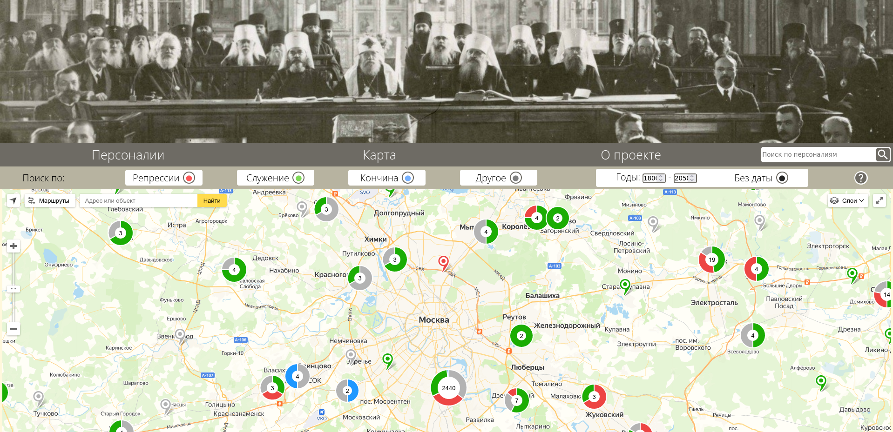
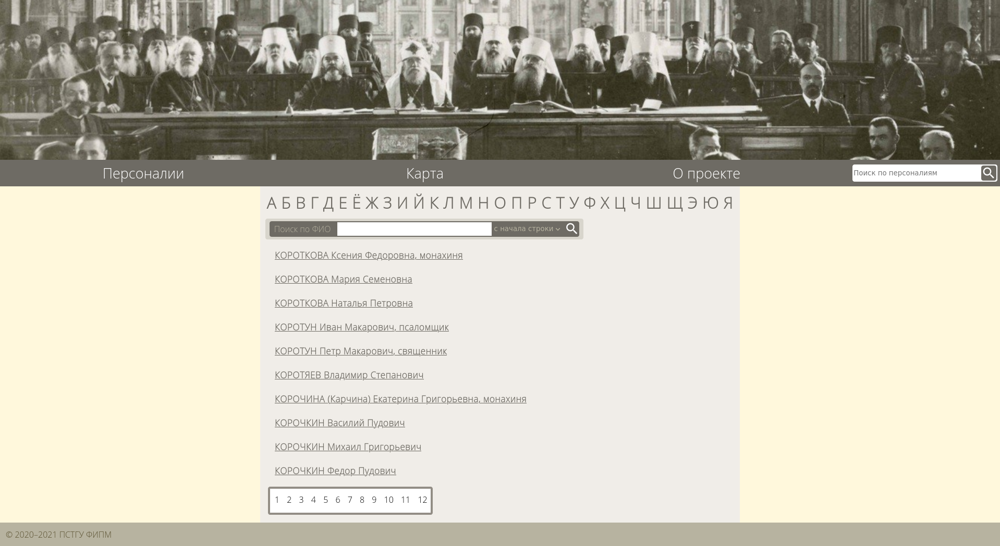
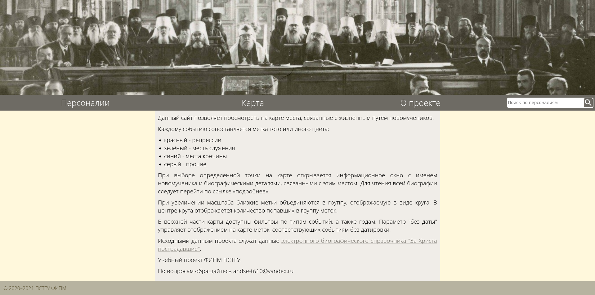

# NmMap. Карта мест, связанных с Новомучениками

Проект позволяет исследовать биографии пострадавших в годы гонений людей, включая причисленных к лику святых Новомучеников и исповедников Российских, с помощью визуального представления мест, связанных с их жизнеописаниями, на карте. Работа доступна на сайте [map.nmbook.ru](http://map.nmbook.ru/).

Основная цель проекта — отобразить на карте все места, так или иначе связанные с жизненным путём Новомучеников, чтобы можно было ответить на вопрос: "Кто из Новомучеников связан с данной местностью и каким образом?"

## Важность

Важным ключом в изучении жизненного пути человека может стать визуальное представление и изучение данных, которыми владеет исследователь. Проект NmMap позволяет отобразить на карте места, в которых находился человек в известный момент времени, включая краткое биографическое сведение и ссылку на статью с биографией.

Как проект может быть полезен для исследователя? Просмотр двух, трех, пяти точек на карте может не дать исследователю значимой информации, но отображение 10000 точек открывает новые возможности для статистического исследования. К примеру, можно увидеть на карте места массовых репрессий, посмотреть, какие люди были знакомы друг с другом или проживали в одном населенном пункте, обзорно увидеть жизненный путь человека, подвергшегося репрессиям.

Разработанный программный продукт может быть полезен для всех людей. Проживая в некотором регионе, человек может найти места в окресностях своего дома, в которых жили, трудились или были репресированы пострадавшие за веру в годы гонений. С помощью функции полнотекстового поиска, можно найти родственников или однофамильцев или факты из их жизнеописаний. Проект может быть использован для проведения занятий по истории в учебных заведениях в качестве наглядного пособия.

## Актуальность

В епархиях Русской православной Церкви издаются сборники с жизнеописаниями пострадавших за веру людей, репресированных в XX веке. Объемы получаемой информации можно отнести к категории Big Data. Для исследования поступающей информации, разумным решением будет применение иструментов автоматизации. Одним из таких инстументов является проект NmMap. 

Наш проект позволяет проводить анализ географических данных на карте. Системы, которая позволяет это делать в большом масштабе (страна) не было найдено в свободном доступе. Существует сервис [martyrmap.ru](http://martyrmap.ru/), но он предоставляет покрытие точками на карте Московской области и небольшой ее окрестности. Существуют карты: исторических храмов: [temples.ru](http://temples.ru/) и мест репрессий: [mapofmemory.org](https://mapofmemory.org/). Мы можем агрегировать разрозненные данные и построить общую картину, что актуально для исторических исследований и просветительской работы.  

## Задачи

Полный список задач можно найти на домашней странице проекта: https://github.com/and-se/NmMap/issues. К основным задачам по направлениям работы можно отнести следующие:

1. Подготовка данных для отображения точек на карте:

  * извлечение адресов и координат из имеющихся текстовых файлов, а также сторонних ресурсов http://temples.ru http://martyrmap.ru https://mapofmemory.org 
  _имеющиеся наработки https://github.com/and-se/retro-geocoding,
  * соотнесение адресов в биографиях с полученными на предыдущем шаге координатами,

2. Совершенствование отображения карты на сайте:

  * подключение нескольких поставщиков карт (сейчас используется только Яндекс),
  * режимы работы карты — для отдельного человека, связи между людьми,
  * просмотр всего жизненного пути выбранного человека в виде маршрута на
карте,

3. Улучшение полнотекстового поиска:

  * ускорение работы: сделать полнотекстовый индекс,
  * поддержка оператора ИЛИ, скобок,
  * выгрузка результатов поиска,

3. Интеграция проекта с существующей базой данных Новомучеников и исповедников Российских,

4. Добавление большого количества биографий пострадавших за веру по мере выхода изданий биографического справочника "За Христа пострадавшие".

## \*Подробнее о прототипе проекта

